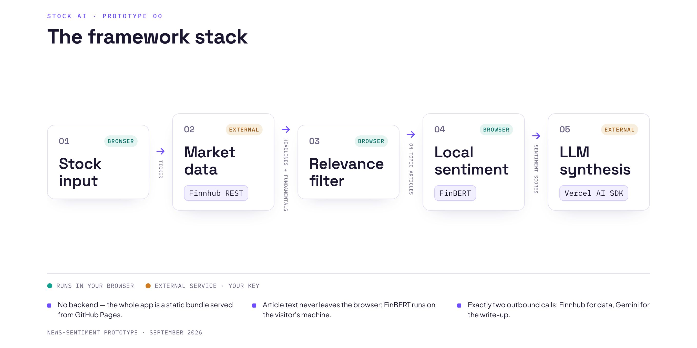

# Stock AI

Type a ticker, get a curated read on its recent news. A local FinBERT pass scores
the sentiment of each article in your browser; a single LLM call turns that plus
the fundamentals into a one-paragraph synthesis and a handful of scored
dimensions. No backend — the whole thing is a static bundle, bring-your-own-key.



## Pipeline

| # | Stage | Runs | Tool |
|---|-------|------|------|
| 1 | **Stock input** — ticker entry | browser | React |
| 2 | **Market data** — quote, fundamentals, trailing price returns, 14 days of company news | external | Finnhub REST |
| 3 | **Relevance filter** — drops market round-ups and "N stocks to buy" listicles (headline patterns + Finnhub's related-ticker count) | browser | plain TypeScript |
| 4 | **Local sentiment** — 3-class sentiment per article, then a recency-weighted aggregate and per-source rollup | browser | [FinBERT](https://huggingface.co/Xenova/finbert) via [Transformers.js](https://github.com/huggingface/transformers.js) |
| 5 | **LLM synthesis** — one JSON-Schema-constrained call returns six scored dimensions with rationales, a one-paragraph read, and a directional lean | external | [Vercel AI SDK](https://sdk.vercel.ai) → Google Gemini |

The FinBERT model (~110 MB, int8 ONNX) downloads once from the Hugging Face CDN
and is cached by the browser; every run after that is offline. Article text never
leaves the page. The only two outbound calls are Finnhub for data and Gemini for
the write-up.

## Output

- **Sentiment grid** — six articles, at most two per outlet, each with FinBERT's
  positive / neutral / negative split.
- **Scored dimensions** — media outlook, risk level, catalyst momentum, source
  consensus, fundamentals fit, substance vs. hype — 0–100 with a hover
  explanation, alongside the synthesis paragraph.
- **BUY / SELL / HOLD badge** — the model's directional lean and confidence.
- **Company snapshot** — valuation ratios, analyst consensus, insider
  transactions, peers, and a small price-return chart.

## Running locally

Requires Node 20+.

```bash
npm install
npm run dev      # Vite dev server
npm run build    # type-check + production build to dist/
npm run lint     # oxlint
```

Two API keys, both entered in the app's **Settings** panel and stored only in
your browser's `localStorage`:

- **Finnhub** — free tier is enough for everything used here.
  [finnhub.io](https://finnhub.io/) → dashboard.
- **Google Gemini** — for the synthesis step only; the sentiment grid works
  without it. [aistudio.google.com/apikey](https://aistudio.google.com/apikey).

## Deploy

Push to `main` and the workflow in `.github/workflows/deploy.yml` builds and
publishes to GitHub Pages. `vite.config.ts` sets `base` to the repo name for
project-page hosting.

## Not financial advice

This is an automated summary of public news sentiment for informational purposes
only. Do your own research before making investment decisions.
